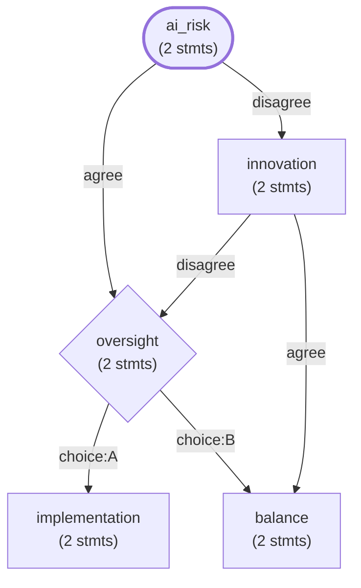

# difficult_dialogs

difficult_dialogs is a structured argumentation framework. An LLM generates the content of a debate once, as plain-text argument files. A deterministic policy engine then runs the debate any number of times, without another LLM call.

[]()
[]()
[]()
[]()

---

## Why use it

An LLM used directly for a debate has four problems. It can hallucinate facts mid-conversation. It costs money on every call at scale. It adds two to five seconds of latency per turn. It needs network access.

difficult_dialogs separates the content of an argument from its delivery. Generate the argument once with an LLM, about sixty seconds per topic. Store it as plain-text files: `.premise`, `.support`, `.source`, `.why`, `.who`, and related fields. From then on, a policy engine runs the debate in under one millisecond per turn, offline, at no per-turn cost. The files are auditable and work with `git diff`.

You can also layer an `LLMEnhancedPolicy` on top of any policy to rephrase responses at runtime, without changing the underlying argument structure.

---

## Install

```bash
uv pip install difficult-dialogs                  # core + OVOS yes/no solver
uv pip install "difficult-dialogs[server]"        # + FastAPI REST server
uv pip install "difficult-dialogs[dev]"           # + pytest, ruff, mypy
```

Python 3.10+. Requires `ovos-plugin-manager`, `ovos-solver-yes-no-plugin`, `ovos-solver-bm25-plugin`, and `rank-bm25` (all installed automatically).

---

## Quick start

### CLI

```bash
did debate    examples/i_think_therefore_i_am        # interactive debate
did list      examples/sample_arguments              # browse library
did validate  examples/sample_arguments              # quality report
did serve     --port 8080                            # REST API server
did generate  "Solar energy is cost-effective" \
             --server http://localhost:8000          # LLM-generate an argument
```

### Python

```python
from difficult_dialogs import Argument, KnowItAllPolicy

arg = Argument.from_directory("examples/i_think_therefore_i_am")
policy = KnowItAllPolicy(arg)

print(policy.start())

gen = policy.run_sync()
response = next(gen)
while response:
    print("BOT:", response)
    try:
        response = gen.send(input("USER: "))
    except StopIteration:
        break
```

### Fluent builder

```python
from difficult_dialogs.builder import ArgumentBuilder

arg = (
    ArgumentBuilder("climate_change")
    .intro("Let's discuss climate change.")
    .conclusion("The evidence is clear.")
    .premise("human_causation")
        .statement("97% of climate scientists agree.")
        .support("See IPCC AR6.")
        .source("https://www.ipcc.ch/")
        .why("CO₂ traps heat in the atmosphere.")
        .who("Climate scientists and IPCC working groups.")
        .done()
    .build()
)
```

---

## File format

Arguments are plain-text directories, one subdirectory per premise:

```
argument_name/
├── intro.dialog              # Opening statement
├── conclusion.conclusion     # Closing statement
└── premise_name/
    ├── premise_name.premise  # Core claims (one per line)
    ├── premise_name.support  # Comeback arguments (optional)
    ├── premise_name.source   # Citation URLs (optional)
    ├── premise_name.what     # Six-Ws contextual fields (optional)
    ├── premise_name.why
    ├── premise_name.how
    ├── premise_name.when
    ├── premise_name.where
    └── premise_name.who
```

UTF-8, one entry per line. Works with `git diff`, `grep`, any text editor.
Full reference: [docs/argument-format.md](docs/argument-format.md)

---

## Graph visualization

Arguments with branching (`.on_agree`/`.on_disagree`/`.choices`) form directed
graphs. View a graph with `did graph`:

```bash
did graph examples/sample_arguments/technology/should_ai_be_regulated
```



Also available as DOT (`--format dot`) and JSON (`--format json`).
Browse all sample graphs: [docs/GRAPHS.md](docs/GRAPHS.md)

---

## Policies

A policy sets the "personality" of the dialog. The argument content stays the same across all policies.

| Policy | Style | Uses support | Asks questions |
|---|---|---|---|
| `KnowItAllPolicy` | Persuasive: corrects with evidence | Yes | No |
| `SilentPolicy` | Lecture: no interaction | No | No |
| `SocraticPolicy` | Questioning, using the Socratic method | Yes | Yes |
| `DebatePolicy` | Adversarial: challenges the user | Yes | Yes |
| `ExploratoryPolicy` | Neutral: presents multiple sides | Yes | Yes |
| `MaieuticPolicy` | Guided discovery | Yes | Yes |
| `SkepticPolicy` | Doubting: the user must prove the point | Yes | Yes |
| `TeacherPolicy` | Educational, with a lesson structure | Yes | Yes |
| `DebaterPolicy` | Formal debate rules | Yes | Yes |
| `MinimalistPolicy` | Terse confirmations only | No | No |
| `AdaptivePolicy` | Switches policy after N disagreements | via inner | via inner |
| `WebhookPolicy` | Forwards to an HTTP endpoint, with a local fallback | Yes | No |
| `LLMEnhancedPolicy` | Rephrases responses through an LLM at runtime | via inner | via inner |
| `MultiArgumentPolicy` | Chains multiple arguments in sequence | via inner | via inner |
| `MultiChoicePolicy` | Presents labeled choices (A/B/C) each turn | Yes | Yes |
| `CooperativePolicy` | Acknowledges disagreement and seeks common ground | Yes | Yes |

```python
from difficult_dialogs import get_policy, Argument

arg = Argument.from_directory("my_argument")
policy = get_policy("socratic", arg)   # by name via POLICY_REGISTRY
```

Full reference: [docs/POLICIES.md](docs/POLICIES.md)

### LLMEnhancedPolicy

Add natural language variety to any policy without changing its argument logic:

```python
from difficult_dialogs.policy import LLMEnhancedPolicy, KnowItAllPolicy
from difficult_dialogs.llm import LLMEnhancer

enhancer = LLMEnhancer("http://localhost:8000", model="qwen-7b")
policy = LLMEnhancedPolicy(
    arg,
    inner_policy=KnowItAllPolicy(arg),
    enhancer=enhancer,
    style="friendly",   # "conversational" | "formal" | "friendly" | "academic"
)
```

If the LLM server is unreachable, the policy falls back to the original text.

### AdaptivePolicy

Softens its approach automatically when the user keeps disagreeing:

```python
from difficult_dialogs import AdaptivePolicy, KnowItAllPolicy, ExploratoryPolicy

policy = AdaptivePolicy(
    arg,
    initial_policy=KnowItAllPolicy(arg),
    fallback_policy=ExploratoryPolicy(arg),
    switch_threshold=3,
)
```

### MultiArgumentPolicy

Chain multiple arguments into one session:

```python
from difficult_dialogs import MultiArgumentPolicy

policy = MultiArgumentPolicy(
    [(intro_arg, "silent"), (main_arg, "knowitall"), (close_arg, "minimalist")]
)
```

---

## Session state & transcripts

```python
# Save
state_dict = policy.state.to_dict()   # JSON-safe dict

# Restore
policy.restore_state(state_dict)

# Export transcript
from difficult_dialogs.export.transcript import export_transcript_to_markdown
md = export_transcript_to_markdown(policy, title="Session 1")
```

---

## Argument library search

```python
from difficult_dialogs.library import ArgumentLibrary

lib = ArgumentLibrary("arguments/").scan()
results = lib.search("climate change", limit=5)
for r in results:
    print(r.argument.name, r.score)

lib.by_category("health")    # all arguments in a top-level subdirectory
lib.get("free_will_exists")  # direct lookup by name
```

---

## Export

```python
from difficult_dialogs.export import export_to_json, export_to_markdown
from difficult_dialogs.export.sqlite import LibraryDatabase

export_to_json(arg, "argument.json")
export_to_markdown(arg, "argument.md")

db = LibraryDatabase("library.db")
db.add_argument(arg, category="philosophy")
db.close()

# Argument diff — review LLM-generated changes before committing
diff = original.diff(updated)
# {"meta": ..., "added_premises": [...], "removed_premises": [...], "modified_premises": {...}}
```

---

## LLM generation

Requires an OpenAI-compatible server (Ollama, llama.cpp, OpenAI API, etc.):

```python
from difficult_dialogs.llm import ArgumentGenerator

gen = ArgumentGenerator("http://localhost:8000", model="qwen-72b")
arg = gen.generate("Solar energy is cost-effective", stance="pro", depth=2)
arg.save("arguments/solar_energy")
```

Or from the CLI:

```bash
did generate "Solar energy is cost-effective" \
  --server http://localhost:11434 \
  --model qwen-72b \
  --output arguments/
```

**Supported servers:**
```bash
ollama serve                                               # http://localhost:11434
./llama-server -m model.gguf --host 0.0.0.0 --port 8000   # http://localhost:8000
# OpenAI: --server https://api.openai.com/v1 --model gpt-4o
```

---

## REST server

```bash
did serve --host 0.0.0.0 --port 8080
```

| Endpoint | Description |
|---|---|
| `POST /sessions` | Create session (`argument_path`, `policy`) |
| `POST /sessions/{id}/chat` | Send turn (`user_input`) |
| `GET  /sessions/{id}` | Full session info |
| `GET  /sessions/{id}/state` | Serialized `PolicyState` |
| `PUT  /sessions/{id}/state` | Restore saved state |
| `DELETE /sessions/{id}` | End session |
| `GET  /arguments` | List available argument directories |

---

## Validation

```python
from difficult_dialogs.validators import validate_argument, ArgumentValidator

result = validate_argument(arg)
print(result.score)                                  # 0.0-1.0
print(ArgumentValidator().get_quality_label(result.score))  # "Excellent ⭐" | "Good 👍" | "Fair 😐" | "Poor ❌"
for issue in result.issues:
    print(issue)
```

---

## Testing

```bash
uv run pytest test/ -v
uv run pytest test/ --cov=difficult_dialogs --cov-report=term-missing
```

**701 tests, 97% average coverage.**

---

## Project layout

```
difficult_dialogs/
├── statements.py        # Statement dataclass
├── premises.py          # Premise — Six Ws: what/why/how/when/where/who
├── arguments.py         # Argument — load/save/diff/merge
├── builder.py           # ArgumentBuilder / PremiseBuilder fluent API
├── policy.py            # BasePolicy + 16 concrete policies + registry
├── library.py           # ArgumentLibrary — keyword search
├── validators.py        # Quality scoring
├── server.py            # FastAPI REST server
├── cli.py               # did / difficult-dialogs CLI
├── export/
│   ├── json.py          # JSON export
│   ├── sqlite.py        # SQLite export
│   ├── markdown.py      # Markdown export
│   └── transcript.py    # Session transcript export
└── llm/
    ├── client.py        # OpenAI-compatible HTTP client
    ├── generator.py     # Argument generation from topic string
    └── enhancer.py      # Runtime statement rephrasing
```

---

## Comparison

| | difficult_dialogs | Raw LLM | Other debate tools |
|---|---|---|---|
| Cost per debate | $0 after generation | $0.10-0.50 | Varies |
| Latency | Under 1 ms | 2-5 s | 1-3 s |
| Offline | Yes | No | No |
| Hallucinations | None | Possible | Sometimes |
| Auditable content | Yes, plain text | No, black box | Limited |
| Git-versionable | Yes | No | Partial |
| LLM enhancement | Optional | Required | N/A |

---

## Documentation

- [docs/index.md](docs/index.md): overview and navigation
- [docs/argument-format.md](docs/argument-format.md): file format reference
- [docs/USER_GUIDE.md](docs/USER_GUIDE.md): end-user manual
- [docs/DEVELOPER_GUIDE.md](docs/DEVELOPER_GUIDE.md): API reference
- [docs/POLICIES.md](docs/POLICIES.md): policy reference
- [docs/GRAPHS.md](docs/GRAPHS.md): premise graphs for all sample arguments
- [docs/cli.md](docs/cli.md): CLI reference (`did graph`, `did stats`, `did debate`, and others)

---

## Contributing

```bash
git clone https://github.com/TigreGotico/difficult_dialogs
cd difficult_dialogs
uv pip install -e ".[dev]"
uv run pytest test/ -v
```

PRs target the `dev` branch.
Report issues on the [issue tracker](https://github.com/TigreGotico/difficult_dialogs/issues).

---

## Related projects

- [TigreGotico/emotion-algebra](https://github.com/TigreGotico/emotion-algebra): structured data for working with human emotions, usable alongside argument policies.
- [TigreGotico/py-argmining](https://github.com/TigreGotico/py-argmining): argument mining tools that can feed source material into an argument directory.

---

## License

Apache 2.0. See [LICENSE](LICENSE).
