# Sample Argument Graphs

Premise graphs for all [sample arguments](../examples/sample_arguments/),
generated with `did graph`. Each node is a premise; edges show the dialog
flow (agree/disagree/choice). Mermaid diagrams render natively on GitHub.

> **Regenerate:** `for d in examples/sample_arguments/*/*; do did graph "$d"; done`

---

## Education

### critical thinking should be taught in schools
*2 premises, 10 statements*

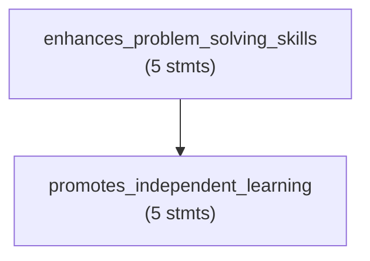

### lifelong learning is essential in modern society
*2 premises, 10 statements*

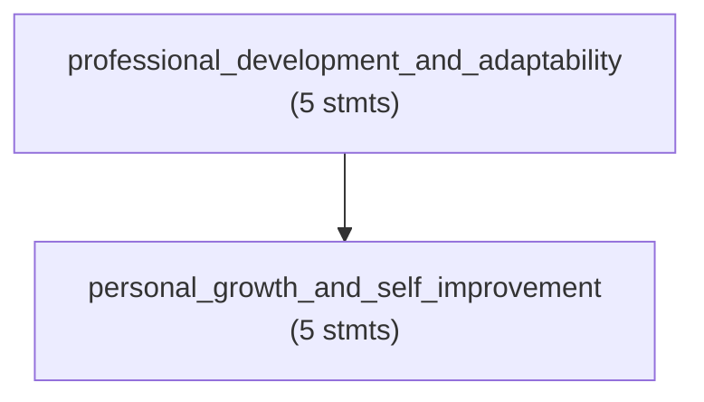

### online learning is as effective as in-person
*2 premises, 10 statements*

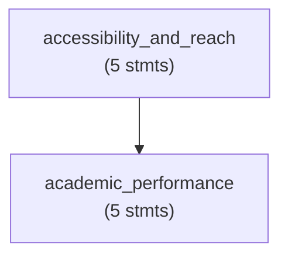

### standardized tests dont measure intelligence
*2 premises, 11 statements*

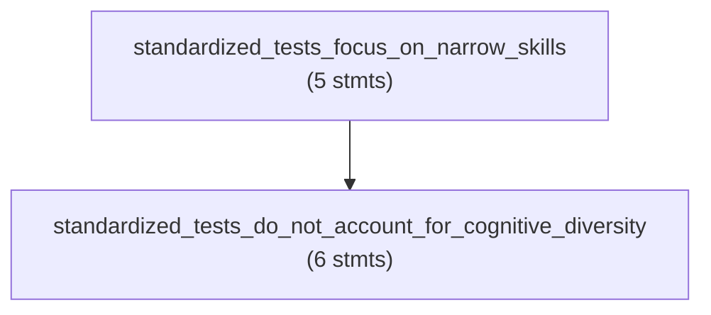

### teachers should be paid more
*2 premises, 10 statements*

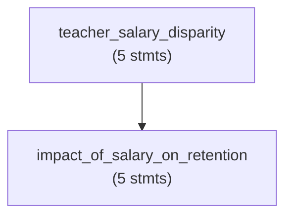

## Health

### a plant-based diet is healthier
*2 premises, 10 statements*

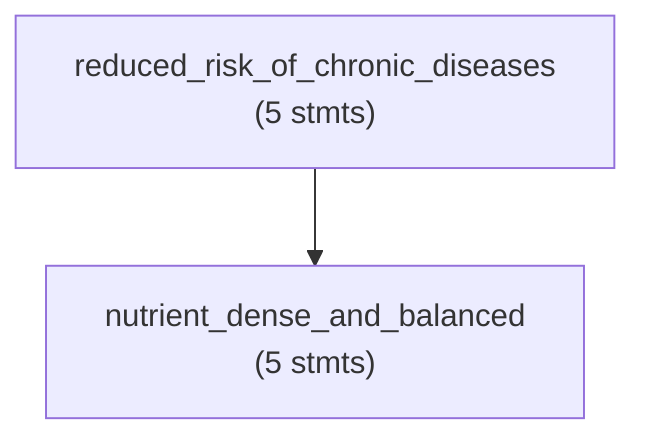

### meditation reduces stress effectively
*2 premises, 10 statements*

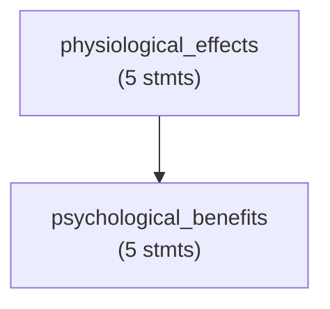

### preventive care is better than treatment
*2 premises, 10 statements*

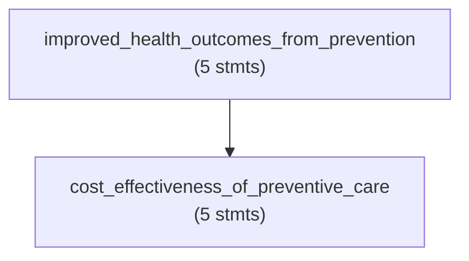

### regular exercise improves mental health
*2 premises, 14 statements*

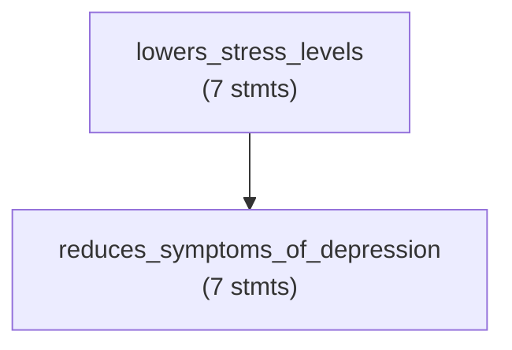

### sleep is essential for cognitive function
*2 premises, 12 statements*

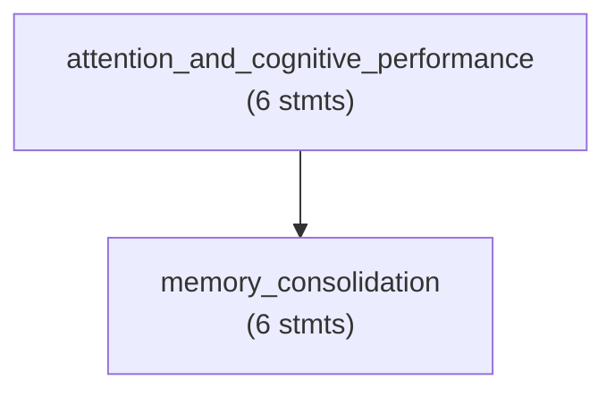

## Philosophy

### free will exists
*2 premises, 14 statements*

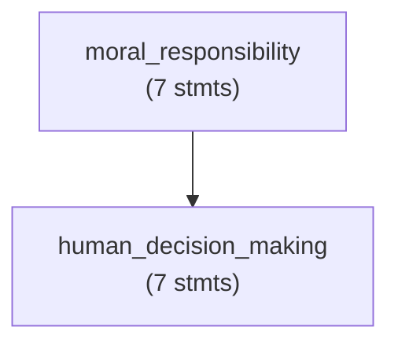

### happiness is the highest good
*2 premises, 10 statements*

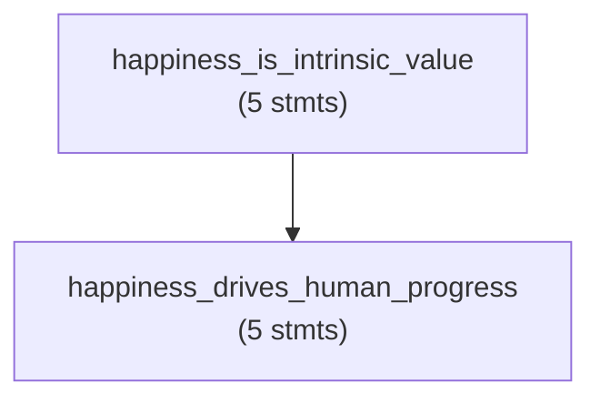

### i think therefore i am
*2 premises, 14 statements*

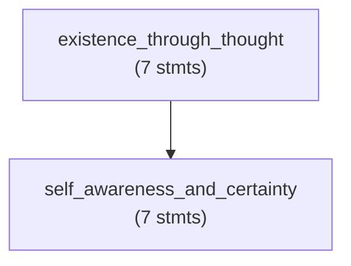

### knowledge is more valuable than pleasure
*2 premises, 10 statements*

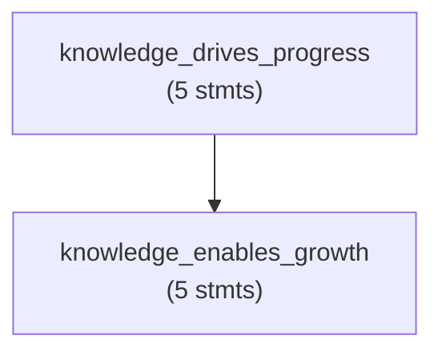

### the ends justify the means
*2 premises, 10 statements*

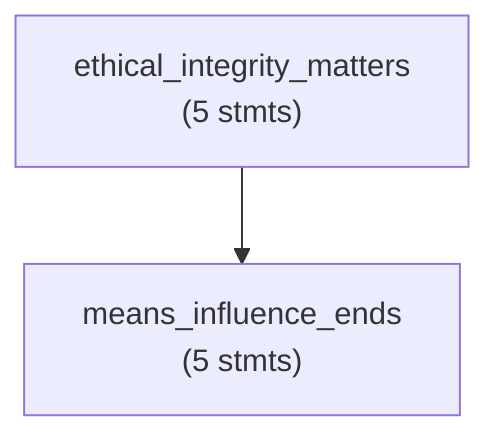

## Science

### climate change requires immediate action
*2 premises, 12 statements*

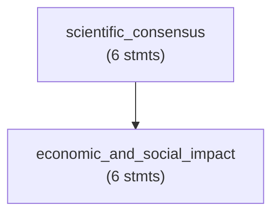

### genetic engineering should be regulated
*2 premises, 10 statements*

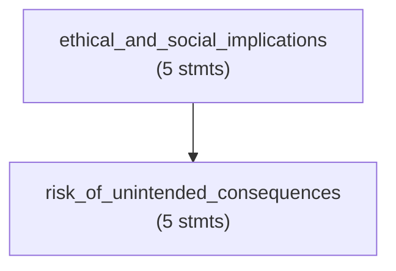

### renewable energy can replace fossil fuels
*2 premises, 12 statements*

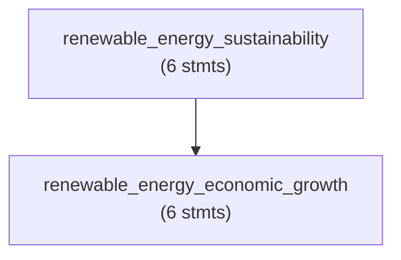

### space exploration is worth the cost
*2 premises, 11 statements*

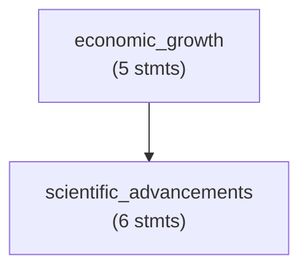

### vaccines are safe and effective
*2 premises, 14 statements*

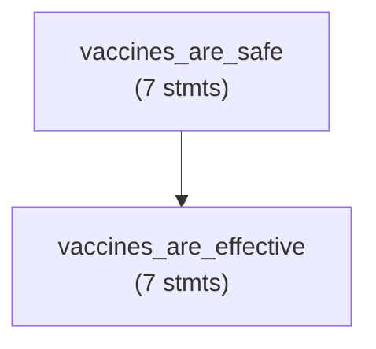

## Society

### cities should prioritize public transportation
*2 premises, 12 statements*

```mermaid
graph TD
    economic_and_social_benefits["economic_and_social_benefits\n(6 stmts)"]
    reduces_traffic_and_pollution["reduces_traffic_and_pollution\n(6 stmts)"]
    economic_and_social_benefits --> reduces_traffic_and_pollution
```

### higher education should be free
*2 premises, 12 statements*

```mermaid
graph TD
    social_mobility["social_mobility\n(6 stmts)"]
    economic_growth["economic_growth\n(6 stmts)"]
    social_mobility --> economic_growth
```

### recycling programs are effective
*2 premises, 12 statements*

```mermaid
graph TD
    conserves_natural_resources["conserves_natural_resources\n(6 stmts)"]
    reduces_waste_volume["reduces_waste_volume\n(6 stmts)"]
    conserves_natural_resources --> reduces_waste_volume
```

### universal basic income would reduce poverty
*2 premises, 12 statements*

```mermaid
graph TD
    financial_security_for_all["financial_security_for_all\n(6 stmts)"]
    economic_participation_and_growth["economic_participation_and_growth\n(6 stmts)"]
    financial_security_for_all --> economic_participation_and_growth
```

### volunteering benefits both giver and receiver
*2 premises, 10 statements*

```mermaid
graph TD
    personal_growth_and_skill_development["personal_growth_and_skill_development\n(5 stmts)"]
    community_and_social_impact["community_and_social_impact\n(5 stmts)"]
    personal_growth_and_skill_development --> community_and_social_impact
```

## Technology

### artificial intelligence will benefit humanity
*2 premises, 12 statements*

```mermaid
graph TD
    economic_growth["economic_growth\n(6 stmts)"]
    healthcare_improvements["healthcare_improvements\n(6 stmts)"]
    economic_growth --> healthcare_improvements
```

### open source software is superior to proprietary
*2 premises, 10 statements*

```mermaid
graph TD
    cost_and_accessibility["cost_and_accessibility\n(5 stmts)"]
    transparency_and_security["transparency_and_security\n(5 stmts)"]
    cost_and_accessibility --> transparency_and_security
```

### privacy is more important than convenience
*2 premises, 10 statements*

```mermaid
graph TD
    convenience_compromises_long_term_security["convenience_compromises_long_term_security\n(5 stmts)"]
    privacy_protection_individual_rights["privacy_protection_individual_rights\n(5 stmts)"]
    convenience_compromises_long_term_security --> privacy_protection_individual_rights
```

### remote work increases productivity
*2 premises, 12 statements*

```mermaid
graph TD
    fewer_workplace_distractions_increase_focus["fewer_workplace_distractions_increase_focus\n(6 stmts)"]
    work_life_balance_improves_productivity["work_life_balance_improves_productivity\n(6 stmts)"]
    fewer_workplace_distractions_increase_focus --> work_life_balance_improves_productivity
```

### should ai be regulated *(branching)*
*5 premises, 10 statements*

```mermaid
graph TD
    implementation["implementation\n(2 stmts)"]
    oversight{"oversight\n(2 stmts)"}
    innovation["innovation\n(2 stmts)"]
    balance["balance\n(2 stmts)"]
    ai_risk["ai_risk\n(2 stmts)"]
    oversight -->|"choice:A"| implementation
    oversight -->|"choice:B"| balance
    innovation -->|"agree"| balance
    innovation -->|"disagree"| oversight
    ai_risk -->|"agree"| oversight
    ai_risk -->|"disagree"| innovation
```

### social media does more harm than good
*2 premises, 6 statements*

```mermaid
graph TD
    erosion_of_truth["erosion_of_truth\n(3 stmts)"]
    mental_health_harm["mental_health_harm\n(3 stmts)"]
    erosion_of_truth --> mental_health_harm
```

---
[← CLI](cli.md) · [Home](index.md) · [User guide →](USER_GUIDE.md)
